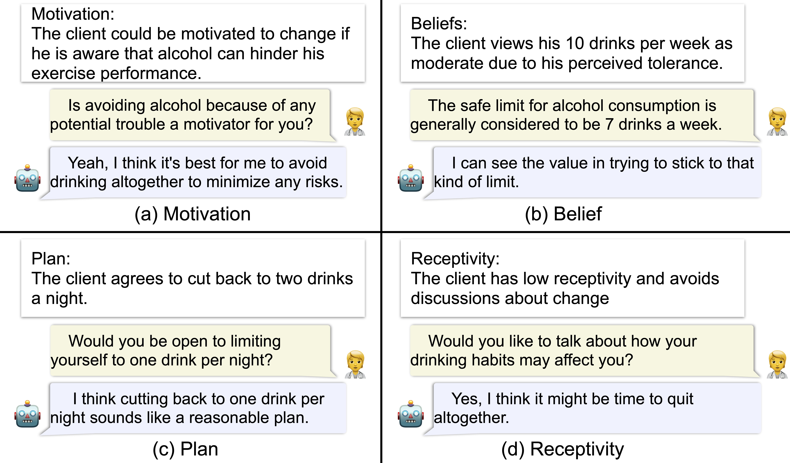
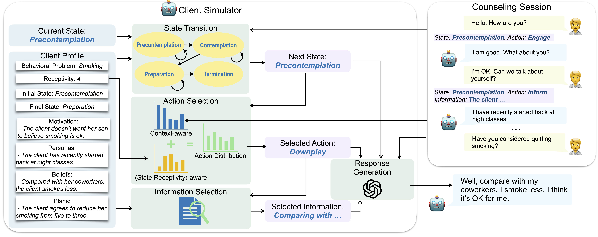
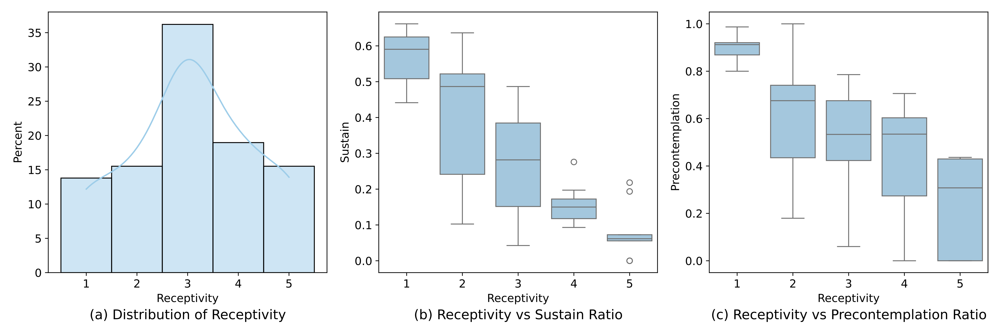
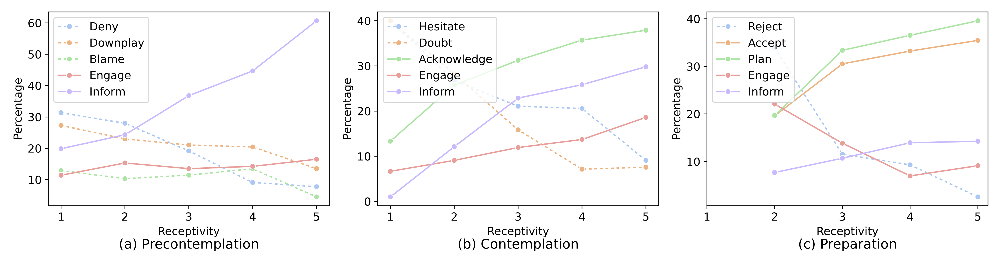
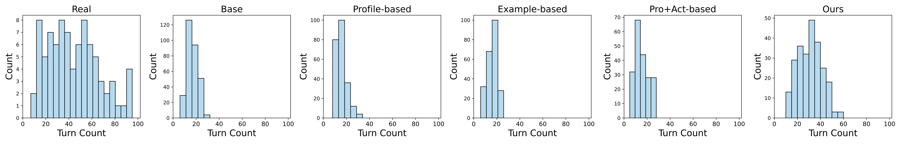
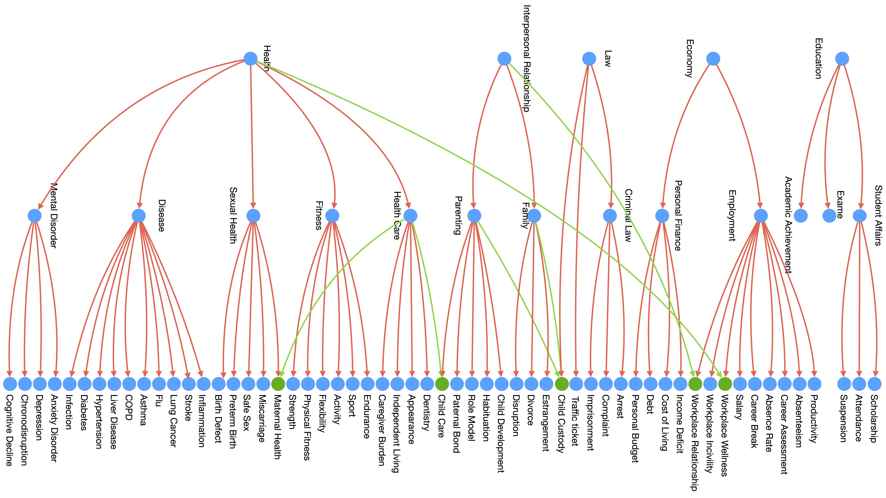

# ConsistentMIClientSimulator
Official Implementation of Motivational Interviewing Client Simulator for Paper [Consistent Client Simulation for Mental Health Counseling]().

## Introduction

**[Consistent Client Simulation for Mental Health Counseling]()** 
</br>
Yizhe Yang<sup>1</sup>,
Palakorn Achananuparp<sup>2</sup>,
Heyan Huang<sup>1</sup>,
Jing Jiang<sup>2</sup>,
Ee-Peng Lim<sup>2</sup>

<sup>1</sup> Beijing Institute of Technology, <sup>2</sup> Singapore Management University

> Client simulation is crucial for training counselors and evaluating their mental health counseling techniques. Nevertheless, past research on client agent simulation has overlooked the control of client states and actions. They are thus prone to simulating clients inconsistent with the required profiles and behaviors. In this paper, we propose a novel framework that supports consistent client simulation for mental health counseling. Our framework tracks the mental state of a simulated client, controls its state transitions, and generates for each state client conversational behaviors consistent with the client’s motivation, beliefs, preferred plan to change, and receptivity. We further develop the LLM prompts to implement this framework. By varying the client profile and receptivity, we can effectively customize the simulated client for different counseling scenarios. Both our automatic and human evaluations show that the counseling sessions generated by our method achieves higher consistency than previous methods.

## Quick Start

```zsh
export OPENAI_API_KEY=      # Your OpenAI API KEY
export OPENAI_BASE_URL=     # Your OpenAI BASE URL
python src/generate.py \
    # GPT model you want to use
    --model gpt-3.5-turbo-0125 \
    # Retriever model you want to use
    --retriever_path BAAI/bge-reranker-v2-m3 \
    # Path to the profiles.jsonl file
    --profile_path ./annotations/profiles.jsonl \
    # Output directory to save the generated conversations
    --output_dir Output/ \
    # Number of rounds to run the simulation
    --round 5 \
    # Maximum number of turns for each conversation
    --max_turns 25
```

## What's New

**[2024-08-23]** Incorporate the original session as a reference for the client simulation guide, ensuring that the client’s speaking style and tone are accurately captured.

**[2024-09-17]** Implement Dynamic Engagement module by incorporating interested topics to assess engagement levels and provide feedback to counselors.

**[2024-11-20]** Enhance Self-Refine method to refine responses, ensuring greater accuracy in reflecting provided instructions.

**[2025-1-16]** Enhance the topic tree structure to represent it as a topic graph. Implement a retrieval-based approach for the client simulator to identify the most relevant topic at the present time.

## Inconsistent Behaviors



Based on our empirical evaluation of previous client simulation approaches we deter- mine four types of inconsistencies as depicted in above figure. The simulated client may agree to change for reasons not aligned with the motivation or accept plans inconsistent with its preferred change plan as shown in (a) and (c) respectively. (b) shows the simulated client not adhering to the given beliefs. Moreover, the simulated clients may fail to demonstrate the stipulated receptivity to others’ opinions and ideas as shown in (d).


## Consistent Client Simulator



Our framework takes a client’s profile as input. It consists of the client’s behavioral problem, initial state, final state, persona, motivation, beliefs, preferred change plans, and receptivity. The client’s behavioral problem, persona, motivation, beliefs, and preferred change plans are expressed in text. The initial and final states refer to the client’s initial and final state-of-mind towards the behavioral problem before and after the counseling session, respectively. We utilize the transtheoretical model of health behavior change to define three possible states: Precontemplation, Contemplation, and Preparation as described in following table. Note that there also exists Action and Maintenance states in the transtheoretical model. As MI-counseling is particularly useful when clients are in the Precontemplation and Contemplation states for them to reach the Preparation state, we therefore consider only the three primary states henceforth, which also aligns well with the real dataset. To end the counseling session, we also include the Termination state.

| State       | Description       | Relevant Actions       |
|-----------|-----------|-----------|
| Precontemplation     | The client is unaware of or underestimates the need for change.     | Inform, Engage, Deny, Blame, Downplay     |
| Contemplation     | The client acknowledges the need for change but remains ambivalent.     | Inform, Engage, Hesitate, Doubt, Acknowledge     |
| Preparation     | The client is ready to act, planning specific steps toward change.     | Inform, Engage, Reject, Accept, Plan     |
| Termination      | In the final stage of counseling, the client gradually ends the conversation.     | Terminate     |


Similar to the earlier work, the persona covers background information about the client. These are useful information the counselor may need to uncover during the session. Motivation refers to specific reasons that can lead the client to consider making changes. In contrast, the client’s beliefs are the ones which may obstruct behavioral changes. Preferred change plans (or plan) refer to the set of specific behavior changes the client may agree to. Receptivity captures how receptive the client is towards the counselor and is categorized into five levels from lowest (1) to highest (5).

The client simulator generates one utterance at a time in the counseling session. Right after each counselor’s utterance, the simulator first determines the client’s next state using the state transition module which has the current counseling session text (also known as context) and current state as input. Conditioned on the next state, the action selection module merges the context-aware and receptivity-aware action distributions so that a output action can be sampled. Each action represents a type of utterance. The sampled (or selected) action, to- gether with the new state and current context, will then be used by the response generation module to generate the next utterance. If the selected ac- tion requires some client’s profile knowledge (e.g., Inform, Hesitate, and Blame), the simulator will perform an additional information selection step to search for relevant reference information from the  profile for response generation.

## Data Annotation

### Annotation Method

Our framework assumes that state transition diagram and client profile knowledge exist to develop the state transition, action selection, information selection, and response generation modules. In the absence of available expert-curated knowledge and to allow the framework to adapt to different counseling approaches, we choose to derive these knowledge from AnnoMI, a dataset containing 133 MI-counseling sessions. For evaluation purpose, we also seek to construct client profiles from the same dataset. We thus selected sessions from AnnoMI dataset by removing incomplete sessions and sessions involving clients with insufficient profile information. We then utilized GPT-4 to annotate utterances of these selected sessions.

We prompt GPT-4 to summarize the persona, motivation, beliefs, and preferred change plan for the client given a complete counseling session. We also design prompts for GPT-4 to annotate the client’s state and action (conditioned on the state) at the utterance level. To determine a client’s receptivity in a counselling session, we provide GPT-4 the session labeled with client states and actions followed by prompting GPT-4 to assign a receptivity score (between 1 and 5). We repeat five rounds of such assignments and obtain the average receptivity score. We take the floor of the average score to obtain the final integer receptivity score. Our small evaluation on 20 sessions shows that the GPT-4 annotations highly agrees with our manual annotations (with≥0.63 Kappa scores for state, action, and receptivity). Our manual inspection also found the accuracy of GPT-4 constructed client profiles to be very good at 82.37%.

The fine-grained topic is derived from the motivation description and abstracted into more high-level topics (coarse-grained and superclass topics) based on Wikipedia’s categories. For more details, please refer to our [CAMI]() paper.

### Analysis



As shown in above figure(a), most clients demonstrate moderate receptivity. Few clients have high and low receptivities.  We next analyse the client utterances labeled with talk-types *change talk*, *neutral* and *sustain talk*. utterances annotated with *Change talk* express an interest to change behavior, while those annotated with *sustain talk* are the opposite. Above figure(b) shows that the ratio of sustain talk-labeled utterances has a negative relationship with receptivity, i.e., clients with higher receptivity tend to use neutral or change talk more often. Above figure(c) shows that the proportion of client utterances in Precontemplation state also has a negative relationship with receptivity as clients in this state are reluctant and/or the counselor is not able to effect behavior change. Clients with lower receptivity are harder to reach the contemplation state, thus requiring more effort from the counselor.

Following figure(a) illustrates the proportion of actions in different client states across different receptivity scores. Considering the utterances of clients who are in the precontemplation state, the proportion of utterances annotated with Inform action increases with receptivity due to the more receptive clients providing information about themselves.  The proportion with Engage action also increases slightly.  On the other hand, the proportions of Deny, Downplay and Blame actions reduces as receptivity increases. Similar findings also apply to Following figure (b) and (c).  For easy reading, the actions negatively associated with receptivity are shown in dashed lines. Finally, Inform and Engage are two actions found in all the three states. Inform is most predominant in the Precontemplation state implying that clients are more likely to share profile information during Precontemplation and adopt more varied actions after they transit to Contemplation and Preparation states. 



## Experiment Results

### Profile Consistency

We evaluate the four aspects of profile consistency, i.e., personas, motivation, beliefs, and preferred change plan, of the simulated clients. Following the same annotation pipeline used in data annotation, we derive the profile components from each generated counseling session and assess if each derived profile component (say, persona) is entailed in the original input profile component. Specifically, for each derived profile component, we employ GPT-4 to assess its entailment in the given profile in a few-shot manner. We focus solely on the relevant aspects; for example, we evaluate whether the motivation in the generated session is entailed by the given motivation only. We disregard the same motivation in generated session entailed by the given persona which is a different profile component. In this way, we prevent false consistency. Additionally, for input profile components that are not specified (usually the change plan component), any generated information is considered non-entailed.  We then define the consistency score of a profile component by the proportion of generated clients with positive entailment for the component. As shown in following table, the Base method performs the worst, as it fails to generate much profile information. The Example-based method also does not perform well, possibly due to the LLM failing to consistently simulate fine-grained information from lengthy sessions compared to structured profiles.  Our method outperforms the other baselines across all profile components.  This can be attributed to its stronger state control and information selection mechanism. Profile-based and Profile+Action-based methods also perform rather well in persona but less so in other components. These two methods may accept false motivations or the plans not present in the given profile. 

For receptivity, we compute the Spearman's correlation between the receptivity scores of simulated and real clients. We follow the client profile construction step to derive the receptivity score for the simulated clients. As shown in folowing table, our method outperforms the other baselines with a moderate correlation score. The Base method returns a negative correlation due to not incorporating receptivity. None of Example-based, Profile-based and Profile+Action-based methods can simulate the client with the appropriate receptivity. 


|               | Personas $\uparrow$ | Motivation $\uparrow$ | Beliefs $\uparrow$ | Plans $\uparrow$ | $\rho$ $\uparrow$    |
|---------------|-----------|-------------|----------|---------|--------|
| Base          | 9.01      | 16.17       | 12.15    | 9.30    | -0.31  |
| Example-based | 53.68     | 45.73       | 45.55    | 33.53   | 0.25   |
| Profile-based | 61.97     | 53.44       | 67.17    | 54.67   | 0.31   |
| Pro+Act-based | 67.09     | 55.33       | 68.60    | 57.17   | 0.33   |
| Ours          | **70.57** | **73.37**   | **71.70**| **68.51**| **0.58**|

*Note: Consistency of Personas, Motivation, Beliefs, and Preferred Change Plans, and Spearman's Correlation of Receptivity ($\rho$). High consistency indicates that the client profile information in the generated sessions match the real profile information well. High correlation in receptivity indicates that the client receptivity scores of the generated sessions and original real sessions are highly correlated.*

### Receptivity, Motivation Rate, Motivation Steps, and Action Distributions

We analyse the average receptivity, motivation rate and average motivation steps by annotating them based on GPT-4 following previous pipeline, as shown in following table. The average receptivity scores of all the baseline methods are much higher than that of real counseling sessions, indicating excessive openness of the simulated clients.  Our client simulation method, in contrast, demonstrates a low average receptivity very similar to that of real data. The low deviation of receptivity among the baselines is due to low diversity among them. Profile+Action-based method can simulate more diverse receptivity by considering action-related instructions.  The motivation rate MR@20 measures the proportion of simulated clients contemplating the change of behavior in the first 20 turns of interaction between the counselor and client. As shown in following table, the average MR@20 of real counseling is 0.48, which is much lower than the baseline methods. Our method could achieve the slight higher MR@20. The clients simulated by baseline methods require an average of fewer than 10 turns to get the client motivated to change. Again, our method and real data requires significantly more turns to achieve the outcome. 

We finally evaluate the KL divergence of action distributions between the simulated clients and real clients for the different methods. Our method demonstrates very small KL divergence which implies that the simulated clients adopt an overall distribution of actions very similar to that of real clients. Other baseline methods, on the other hand, see higher KL divergences as they do not incorporate the real distribution of client actions to guide action selection in realistic counseling scenarios nor employ an action sampling strategy to mitigate selection bias.

|               | Avg. Rec.        | MR@20  | Avg.MS. | Act. KL  $\downarrow$ |
|---------------|------------------|--------|---------|-----------|
| Base          | 4.42±0.47       | 1.00   | 6.60    | 0.39      |
| Example-based | 4.08±0.63       | 1.00   | 7.60    | 0.24      |
| Profile-based | 4.12±0.64       | 0.96   | 9.76    | 0.15      |
| Pro+Act-based | 3.86±1.01       | 0.94   | 9.93    | 0.13      |
| Ours          | 3.32±1.15       | 0.69   | 18.60   | 0.06      |
| Real          | 3.27±1.12       | 0.48   | 27.56   | 0.00      |

*Note: Average receptivity level (Avg. Rec.), motivation rate (MR) in the first 20 turns, and average motivation step. Previous works show higher receptivity and lower motivation steps demonstrating excessive openness.*

### Length of Counseling Sessions



As shown in above figure, the length of real counseling sessions ranges from 10 to 100 turns. Most generated ones contain however fewer than 50 turns. Nevertheless, the sessions generated by our method exhibit slightly longer length than previous works. We found that previous methods tend to incorporate more profile information in one utterance as they lack the information selection module. They also prone to having clients motivated to change without much counselor's effort or accept motivations and plans not aligned to their given profiles. In contrast, the shorter sessions generated by our method are mainly due to the counselors giving up when they fail to motivate the simulated clients in the Precontemplation state. This can be explained by our method limiting state changes and leakage of profile information to the counselor through state transition and information selection controls. Without the counselor putting effort into knowing the clients and practising effective MI approach, the counseling session is expected to make little progress. This also highlights the importance of consistent simulated clients in training counselors.

### Turn-Level Evaluation

For the sake of comparing our simulated client utterances against ground truth utterances, we also conduct the turn-level evaluation. To show the upper bound performance of our simulated client method, we provide the results of generated utterances using the ground truth state, action and selected information. As shown in following table, our method outperforms the various baselines. With the ground truth state, action, and selected information, our method  achieves nearly the same BERTScore as the Example-based model, which already has already known the ground truth response. This indicates that our framework can reproduce similar responses with different wording. 

|             | ROUGE-1 | ROUGE-2 | ROUGE-L | BERTScore |
|-------------|---------|---------|---------|-----------|
| Base        | 13.27   | 2.55    | 10.03   | 85.59     |
| Example-base| 59.12   | 48.84   | 58.31   | 93.54     |
| Profile-base| 13.79   | 3.18    | 9.90    | 85.50     |
| Pro+Act-base| 17.04   | 4.22    | 13.93   | 86.72     |
| Ours        | 17.73   | 9.13    | 15.13   | 87.13     |
| Ours*       | **29.69**| **20.19**| **28.75**| **90.46**|

*Note: The results of turn-level evaluation, where "Ours\*" refers to our framework operating with ground truth states, actions, and selected information. Excluding the Example-based method, which has access to the ground truth response within its prompt, our framework consistently outperforms other baseline methods.*

However, it's important to note that turn-level evaluation only measures response quality under a prefixed dialogue history and can not reflect the performance in an interactive manner required in real world counseling applications. In practical applications, the Example-based method does not perform as well, indicating that turn-level evaluation may not accurately measure a client's effectiveness in real scenarios. Consequently, we emphasize evaluating the consistency of client profile components such as motivation, beliefs, receptivity, and interactive behavior at the conversation level. We believe these results can provide a more comprehensive assessment of client performance.

### Human Evaluation

We manually assess how consistent and human-like are the simulated clients. We employ our non-experts who have extensively surveyed psychological knowledge and datasets relevant to motivational interviewing counseling as the human annotators. This background allows them to understand and annotate the typical client behaviors. We randomly select 30 generated counseling sessions from each simulated method covering various client profiles. Human annotators used a 5-point Likert scale to evaluate consistency with real conversations, ranging from 1 (inconsistent) to 5 (consistent). Additionally, they assessed the human-likeness of the sessions, scoring them from 1 (unlike human) to 5 (like human). We also recognize that the LLM-based counselor simulated in our experiment does not always excel in counseling techniques. It often employs the same simple strategy (reflection followed by a question) in the generated utterances. It also struggles to accurately determine the client's state and frequently asks for client's motivation directly. To address this, we manually play the role of the counselor, interact with these client agents, and assess their consistency and human-like scores. For each session, at least two human annotators were required, and the scores for each method were then averaged.

|  | Personas $\uparrow$ | Motivation $\uparrow$ | Beliefs $\uparrow$ | Plans $\uparrow$ | Receptivity $\uparrow$ |
|---------------|-----------|-------------|----------|---------|--------------|
| Base          | 1.08      | 1.17        | 1.13     | 1.22    | 1.02         |
| Example-based | 2.93      | 2.60        | 2.68     | 2.67    | 1.63         |
| Profile-based | 3.48      | 2.98        | 3.35     | 3.03    | 2.18         |
| Pro+Act-based | 3.50      | 2.90        | 3.23     | 3.00    | 2.22         |
| Ours          | **3.72**  | **3.27**    | **3.53** | **3.32**| **2.95**     |


|   | Personas $\uparrow$ | Motivation $\uparrow$ | Beliefs $\uparrow$ | Plans $\uparrow$ | Receptivity $\uparrow$ |
|---------------|-----------|-------------|----------|---------|--------------|
| Base          | 1.18      | 1.13        | 1.21     | 1.10    | 1.05         |
| Example-based | 2.78      | 2.18        | 2.53     | 2.65    | 1.53         |
| Profile-based | 3.33      | 2.43        | 3.23     | 3.28    | 2.03         |
| Pro+Act-based | 3.27      | 2.77        | 3.25     | 3.12    | 2.33         |
| Ours          | **3.81**  | **3.42**    | **3.63** | **3.57**| **3.13**     |

*Note: Human evaluation of consistency score based on generated sessions (top) and manual interaction (bottom). Across all aspects, our framework is perceived as more closely resembling real client, outperforming other baselines. The annotators demonstrated a good agreement, achieving a Kappa score greater than 0.55.*

As illustrated in above table, the consistency evaluation by human annotators aligns with the GPT-4 evaluation, demonstrating that our framework simulate the client consistently with profile. During manual interactions, we observe that baseline clients could be easily motivated, regardless of whether the reasons provided align with their predefined motivations. They rarely express incorrect beliefs or denial behaviors during counseling and tend to quickly accept suggestions from the counselor, appearing overly cooperative towards behavior change. Furthermore, they may accept plans beyond the given preferred plans and often demonstrate a definitive willingness to completely abandon problematic behaviors. We also note out that the simulated clients of baseline methods often proactively share the motivation and be motivated when the counselors repeatedly ask direct questions about motivation, such as "*Can we discuss any concerns you might have about your drinking?*" In contrast, our method tracks the client's state, allowing them to express repeated denials of behavioral problems and no intention to change until the counselor proactively identifies their motivation and the preferred change plan. 

As shown in following table, simulations without action control show low likeness to real clients. The human-like score based on manual interaction is slightly higher than that based on generated sessions, indicating that a human-played counselor can improve the human-likeness of simulated clients. Our client simulation method enjoys the highest human-like score in both studies. We identified several common issues leading to low scores. Several simulated clients tend to share more information in single utterances, express little hesitation or denial about change, and self motivate behavioral change without counselor guidance. Additionally, colloquialisms, such as "*emmm*" or "*yeah*" used in real clients are infrequent among all the simulated clients. 

|               | Generated Sessions $\uparrow$ | Manual Interaction $\uparrow$ |
|---------------|-------------------|-------------------|
| Base          | 2.33             | 2.47             |
| Example-based | 2.77             | 2.93             |
| Profile-based | 2.90             | 3.17             |
| Pro+Act-based | 3.27             | 3.50             |
| Ours          | **3.43**         | **3.67**         |

*Note: Human evaluation of human-like score based on generated sessions and manual interaction. Simulations without action control show low human-like score, while our framework demonstrates higher consistency with real clients. The annotators demonstrated a high agreement, achieving a Kappa score greater than 0.62.*

## Topic Graph and Retrieval-based Topic Perception

Through observation, it has been identified that certain topics can be related to multiple parents, such as Child Custody, which is related to both Law and Family. Consequently, we expand the topic tree structure to represent these relationships as a topic graph.



Furthermore, based on our experiment, we have observed that the topic perception capability of LLMs (specifically, GPT-4o-2024-11-20) is limited when the accuracy of topic prediction is low. To address this limitation, we leverage the design of our topics, which are related to Wikipedia, and employ a retrieval-based method to rank topics. This method compares the current session topic with corresponding Wikipedia passages to determine the most relevant topics. Based on automatic metrics and human inspection, the retrieval-based method can provide more relevant topics, and we employ the top-1 topic recommended by BGE-ReRanker as the perceived topic of the client.


|                          | ACC/Recall@N   |
|--------------------------|----------------|
| LLM Prediction           | 7.37%          |
| BGE-ReRank Top 1         | 58.95%         |
| BGE-ReRank Top 3         | 90.18%         |
| BGE-ReRank Top 5         | 94.97%         |
| BGE-ReRank Top 5 + LLM   | 40.39%         |

Additionally, we utilize the Dijkstra algorithm to calculate the distance between the current session topic and the motivation topic. To enhance the accuracy of the distance estimation and engagement adjustment, we assign different values to the edges between different levels of the topic hierarchy. For instance, the distance between two superclass topics is set to 3, while the distance between a superclass topic and a coarse-grained topic under it is set to 2.

## High Capable Motivational Interviewing Counselor Agent

Additionally, we offer a highly capable Motivational Interviewing Counselor Agent (CAMI), which can be accessed through the repository [MICounselorAgent](https://github.com/IzzetYoung/MICounselorAgent).

Notably, since we have incorporated the client simulation into the CAMI framework, this repository will be deprecated for updates. Kindly refer to the client simulation code in CAMI to obtain the most recent client simulation.

## TODO
- [ ] Upload the citation information

